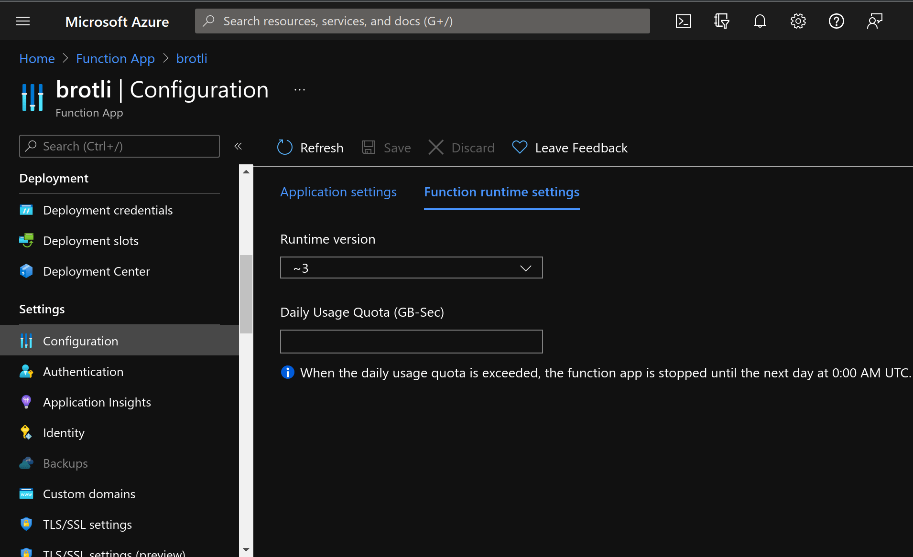

# brotli-azf

Brotli streaming encoding via Azure Functions App

Used by myself on [Brotli online encode/decode tool | mylmoe](https://myl.moe/utils/brotli)

Streaming API enables you to upload big (well, kind of, < 100MB actually) files

## Usage

### Request

Content type should be `multipart/form-data`, which uploads the file to be encoded in binary format

The body should be < 100MB. See [Limits](#limits) for reasons.

The multipart form may contain the following fields:

|name|required|default|description|
|-|-|-|-|
|file|true|/|The binary file to be encoded|
|quality|false|11|Brotli param. The main compression speed-density lever. The higher the quality, the slower the compression. Int which is 0-11. Ref `BROTLI_PARAM_QUALITY` of [Brotli doc](https://brotli.org/encode.html#a9a8).|
|lgwin|false|0|Brotli param. Recommended sliding LZ77 window size. Int which is 10-24 or 0 that means set the field automatically. Ref `BROTLI_PARAM_LGWIN` of [Brotli doc](https://brotli.org/encode.html#a9a8).|

**PLEASE ENSURE `file` FIELD IS THE LAST ONE IN THE MULTIPART FORM.**
All fields after `file` field is ignored.

### Response

Content type is `application/octet-stream`

The body is the result of the encoding

## Limits

### Azure Functions

According to (Azure functions doc)[https://docs.microsoft.com/en-us/azure/azure-functions/functions-bindings-http-webhook-trigger?tabs=csharp#limits],
request body has a **100MB hard limit** which is unconfigurable.

### Custom

If you deploys the app on your own Azure account and need to set a custom consumption limit in case it runs out your money,
use the config `Daily Usage Quota`:

## License

MIT
